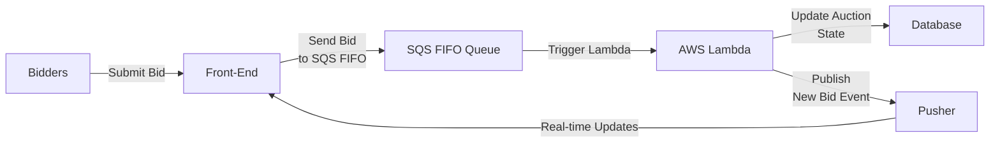

In the modern digital landscape, auctions have gone beyond the traditional auction houses and taken center stage online. Whether you’re building an e-commerce platform, a ticket resale marketplace, or a fundraising site, 
<!-- truncate -->
real-time bidding keeps your users engaged and ensures fair competition. This guide will walk you through the process of designing and implementing a high-performance real-time auction system using AWS services—specifically Amazon SQS FIFO queues, AWS Lambda, and Pusher.

1. [ Introduction to Real-Time Bidding and Auctions](#1-introduction-to-real-time-bidding-and-auctions)

2. [ Core Architecture Overview](#2-core-architecture-overview)

3. [ Why Amazon SQS FIFO Queues?](#3-why-amazon-sqs-fifo-queues)

4. [ Processing Bids with AWS Lambda](#4-processing-bids-with-aws-lambda)

5. [ Ensuring Real-Time Updates with Pusher](#5-ensuring-real-time-updates-with-pusher)

6. [ Handling Multiple Auctions Concurrently](#6-handling-multiple-auctions-concurrently)

7. [ Best Practices and Tips](#7-best-practices-and-tips)

8. [ Conclusion](#8-conclusion)
---

## 1. Introduction to Real-Time Bidding and Auctions

**What is real-time bidding (RTB)?**

Real-time bidding refers to the process of making live offers or bids in a fraction of a second—while an auction is ongoing. In an online auction environment, multiple bidders simultaneously submit their bids on an item (or multiple items) within a specified timeframe. The goal is to capture each bid accurately, determine the highest valid offer, and then display the latest leading bid to all participants in real-time.

**Key challenges:**

- **Concurrency**: Multiple bidders submitting offers at the same time.
- **Ordering**: Ensuring that each bid is processed in the correct sequence.
- **Scalability**: Handling multiple concurrent auctions without performance degradation.
- **Real-time updates**: Notifying all bidders of the latest bid status as soon as possible.

---

## 2. Core Architecture Overview

A robust real-time auction platform typically involves the following components:

1. **Front-End**: Displays the auction interface, shows real-time bid updates, and captures user bids.
2. **Queue**: Ensures reliable, ordered message handling for incoming bids.
3. **Processing Layer**: A serverless or microservices layer that processes each bid and updates the system state.
4. **Real-Time Notification Service**: Broadcasts live updates to all participants.
5. **Database**: Stores bid history, user data, and auction details.

Below is a high-level architecture:

---

## 3. Why Amazon SQS FIFO Queues?

**Amazon SQS (Simple Queue Service)** is a fully managed message queuing service from AWS. The FIFO (First-In-First-Out) variant guarantees that messages (bids) are processed in the exact order they are received and that each message is processed exactly once. This is critical in an auction environment where the timing and sequence of bids can determine the winner.

### Key Benefits of SQS FIFO:

- **Ordering Guarantee**: Ensures the first bid in is the first processed, preventing race conditions.
- **Exactly-Once Processing**: Avoids the dreaded “double-processing” of a single bid.
- **High Throughput**: Scales to handle thousands of messages per second.
- **Easy Integration**: Works seamlessly with AWS Lambda.

For more details on the intricacies of FIFO queues, you can read [Solving Complex Ordering Challenges with Amazon SQS FIFO Queues](https://aws.amazon.com/blogs/compute/solving-complex-ordering-challenges-with-amazon-sqs-fifo-queues/).

---

## 4. Processing Bids with AWS Lambda

**AWS Lambda** is a serverless compute service that lets you run code without managing servers. In a real-time auction scenario, each new bid triggers a Lambda function. The function then:

1. **Validates the bid**: Checks if the bid is higher than the current highest bid, whether the auction is still open, etc.
2. **Updates the auction state**: Stores or updates relevant information in the database (e.g., new highest bid, bidder ID, timestamp).
3. **Notifies the front-end**: Publishes a message to Pusher (or another real-time messaging service) so all participants see the new highest bid.

In your Lambda code, you might have a structure like this:

- **index.js**: Entry point for the Lambda, orchestrating the workflow.
- **processBids.js**: Contains the core business logic to validate and process bids.
- **Other utility files**: Handle different scenarios, such as auctions with extended bidding periods, concurrency checks, etc.

This modular approach keeps the code maintainable and easy to extend.

---

## 5. Ensuring Real-Time Updates with Pusher

Once a valid bid is processed, it’s crucial to broadcast the updated information to all active participants immediately. **Pusher** is a popular real-time messaging service that makes this possible with minimal overhead. By integrating Pusher into your Lambda function:

1. **Push New Bid Events**: Each time the Lambda validates a new highest bid, it sends a push notification to a Pusher channel dedicated to that auction.
2. **Front-End Listeners**: The browser (or mobile app) listens for these channel events. Upon receiving a new bid event, the interface updates automatically, showing the latest highest bid and the bidder’s details (or masked identifier).

This mechanism provides a **seamless** real-time experience for users, similar to a live auction house setting.

---

## 6. Handling Multiple Auctions Concurrently

When you have multiple auctions running at once, concurrency can skyrocket. Here’s how you can manage it:

1. **Unique Identifiers**: Each auction has a unique queue group ID or message group ID in SQS FIFO to ensure that bids for different auctions don’t mix.
2. **Scalable Architecture**: AWS Lambda automatically scales to handle as many concurrent invocations as needed, provided your concurrency limits are set appropriately.
3. **Separate Pusher Channels**: Each auction should have its own Pusher channel. This way, messages (bid updates) only go to participants in that specific auction.

---

## 7. Best Practices and Tips

1. **Use Timeouts Wisely**: Make sure your Lambda function has an appropriate timeout setting. In most cases, your bid processing should be quick, but be mindful of edge cases like network latency.
2. **Implement Idempotency**: If your system somehow reprocesses a message (very rare with FIFO queues, but still possible), ensure your logic can handle duplicates gracefully.
3. **Monitor and Alert**: Set up CloudWatch metrics and alarms to track Lambda invocation errors, queue backlogs, or unusual spikes in bidding volume.
4. **Database Transactions**: Use atomic database operations (like DynamoDB’s conditional writes or relational transactions) to ensure data consistency when updating the highest bid.
5. **Security**: Implement appropriate authentication and authorization, ensuring only authorized bidders can place bids, and the data is transmitted securely (HTTPS/WSS).

---

## 8. Conclusion

Building a **high-performance real-time bidding and auction platform** requires careful attention to concurrency, ordering, and real-time communication. By leveraging **Amazon SQS FIFO queues** for message ordering, **AWS Lambda** for bid processing, and **Pusher** for live updates, you can create an architecture that scales automatically and provides a seamless experience for your users.

This combination of services allows you to handle multiple auctions concurrently with **confidence** in the accuracy of each bid. With minimal infrastructure management (thanks to serverless components), your development team can focus on enhancing user experience, implementing new features, and ensuring the platform continues to run smoothly.

If you’re looking to dive deeper, make sure to check out AWS’s official guide on [Solving Complex Ordering Challenges with Amazon SQS FIFO Queues](https://aws.amazon.com/blogs/compute/solving-complex-ordering-challenges-with-amazon-sqs-fifo-queues/). By following these best practices and leveraging the right AWS services, you can build an auction platform that is both **powerful** and **reliable**—ready for the demands of real-time bidding at any scale.